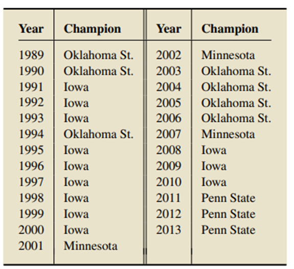
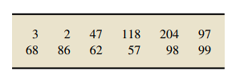
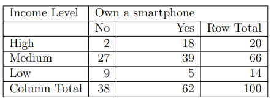

## Introduction

Statistics - Cricket statistics, Stock market statistics

Applications:

- Data Analysis - patterns, trends, relationships, insights
- Statistical modeling -  A statistical model is usually specified as a mathematical relationship between one or more [random variables](https://en.wikipedia.org/wiki/Random_variables "Random variables") and other non-random variables.
- Experimental Design - aims to describe and explain the variation of information under conditions that are hypothesized to reflect the variation.
- Machine Learning -
- Data Visualization -
- Decision Making and Risk Assessment -  assess uncertainty and make informed decisions based on available data
- Anomaly Detection and Quality Control -

Data
Data serves as the raw material for analysis, interpretation, and decision making in various fields, including science, business, technology, and research.

Variable: A characteristic that varies from one person or thing to another.
Data: Values of a variable.

### Numerical ~ Quantitative

Continuous numerical data - from instruments, infinite values
Discrete numerical data - finite values

### Categorical ~ Qualitative

Nominal - is unordered
Ordinal - has ordered values

### Examples

- Human Blood Types = Nominal
- Household Size = discrete
- Temperature = continuous
- Success rate = continuous
- Basketball teams position = ordinal

## Scale of Measurement

### Categorical data

- Frequency distribution - The number of times a particular distinct value occurs is called its frequency (or count).
- Relative Frequency - The ratio of the frequency to the total number of observations is called relative frequency. It is always between 0 and 1, therefore useful for comparison.

### Numerical data

Meaning of 'zero' value in the data is the difference between the two types. It does not make sense in ratio (so true zero exists), but in interval it is valid value (true zero does not  exist).
Also, the scaling of the differences in the value does not have a linear effect in interval scale but is linear in ratio scale.

- **Interval** - Temperature, year, IQ value, credit score
- **Ratio** - distance, area, height, weight, length, time,

Scale of Measurement

- **Bins** - group the observations. Single value grouping, limit grouping, cut-point grouping.

---

### Examples and Q&A

- Numericals

---

---

---

---

---

---

## Types of Statistics

Population vs Sample

Sample should be representative of the population

### Descriptive Statistics

Descriptive statistics consists of methods for organizing and summarizing information. Descriptive statistics includes the construction of graphs, charts, and tables and the calculation of various descriptive measures such as averages, measures of variation, and percentiles.

Data Organization is management, storage and organizing the hierarchy for efficient access.

Data Interpretation assigning meaning to processed and analyzed data.

For Example: A class of 50 students gave an exam (of 100 marks) and the average marks of the class is calculated as 65.

Descriptive Statistics :- Descriptive statistics consists of methods for organizing and summarizing information.

Example:- imagine trying to select the best hitter in the American League given only the official score sheets for each game. (More than 600 games were played in 1948; the best hitter was Ted Williams, who led the league with a batting average of .369.)

### Inferential Statistics

Inferential statistics consists of methods for drawing and measuring the reliability of conclusions about a population based on information obtained from a sample of the population.

Inferential Statistics :- Inferential statistics consists of methods for drawing and measuring the reliability of conclusions about the data/information.

Example:- Voting results

For Example: A teacher wants to know the average marks of all students in the school. Since there is a large number of students in the school, the teacher collects a sample of students from the school and calculates the average marks of the selected students which is, say, 60 marks.

## Q&A

       

---

  

---

           

--- 

  

--- 

  

--- 
   

---
- Ages of Householders. The ages of householders, given as a whole number. Limit
- Number of Smartphones. The number of smartphones per person.	Single-value
- The gas mileages, rounded to the nearest number of miles per gallon, of all new car models.  Limit

  

## Descriptive Measures

Descriptive measures are quantities whose values are determined by the data and can be used to summarize a data set.

Types of Descriptive Measures

- Measures of central tendency: These are measures that indicate the most typical value or center of a data set.
- Measures of dispersion: These measures indicate the variability or spread of a dataset.

## Measures of central tendency

### Mean

- The mean of a data set is the sum of the observations divided by the number of observations.
- The mean is usually referred to as average.
- Sample mean ($\bar{x}$)
- Population mean ($\mu$)
- For grouped discrete data use: $\sum v_i * f_i \over \sum f_i$
- For grouped continuous data use: $\sum v_i * m_i \over \sum f_i$ where mi is the midpoint of the class interval
- Adding a constant to the dataset = adding the constant to the mean (Addition of 5 marks to students)
- Multiplying a constant to the dataset = multiplying the constant to the mean (teacher has decided to scale down each mark by 40%)
- Examples:
  - 2, 105, 5, 7, 6, 7, 3 => 19.29
  - 68, 79, 38, 68, 35, 70, 61, 47, 58, 66 => 59
  - 1 2 3 4 5 : 2 3 5 4 1 => 2.93
  - Age 15 16 17 18 19 20 Frequency 2 5 11 9 14 13 => 18.24

 ans=59.3

 ans = 58.8

 ans = 25.73

 ans = 62

---

#### Mean vs Expectation

Expected Value = Σx * P(x)

### Median

- The median of a data set is the middle value in its ordered list.
- Arrange the data in increasing order.
- If the number of observations is odd, then the median is the observation exactly in the middle of the ordered list.
- If the number of observations is even, then the median is the mean of the two middle observations in the ordered list.
- 300 300 300 300 300 300 400 400 450 450 800 940 1050 => 400
- 300 300 300 300 300 400 400 450 940 1050 => 350
- 2, 12, 5, 7, 6, 7, 3 => 6
- 2, 105, 5, 7, 6, 3 => 5.5
- Addition and Multiplication of a constant to the dataset also scales the median by the constant.
- Note: “Mean is sensitive to outliers, whereas the median is not sensitive to outliers.”
- 2, 12, 5, 7, 6, 7, 3 => (6 and 6) vs 2, 117, 5, 7, 6, 7, 3 => (21, 6)
- Grouped data

  - Calculate the cumulative frequency for the data.
  - n = total number of observations, last value of the cf.
  - Find the median class i.e. mc = class with cf > n computed below.
    - n = odd then $n+1 \over 2$
    - n= even avg($n \over 2$ , $n \over 2 +1$)
  - Median = $l + \frac{\frac{n}{2} - c}{f} * h$
  - l = lower limit of median class
  - n = total number of observations
  - c = [cumulative frequency](https://www.cuemath.com/data/cumulative-frequency/) of the preceding class to the median class
  - f = [frequency](https://www.cuemath.com/frequency-formula/) of median class
  - h = class size (upper limit - lower limit)
  - Example -

| electricity | consumers |
| ------------- | ----------- |
| 65 – 85    | 4         |
| 85 – 105   | 5         |
| 105 – 125  | 13        |
| 125 – 145  | 20        |
| 145 – 165  | 14        |
| 165 – 185  | 8         |
| 185 – 205  | 4         |

---

|                                                    |        |         |         |         |          |
| ---------------------------------------------------- | -------- | --------- | --------- | --------- | ---------- |
| Marks                                              | 0 - 20 | 20 - 40 | 40 - 60 | 60 - 80 | 80 - 100 |
| Number of students                                 | 6      | 20      | 37      | 10      | 7        |
| n = 80, mc = 40-60, l = 40, h = 20, c = 26, f = 37 |        |         |         |         |          |
| Answer = 47.57                                     |        |         |         |         |          |

---

|                                                       |             |             |             |             |             |           |
| ------------------------------------------------------- | ------------- | ------------- | ------------- | ------------- | ------------- | ----------- |
| **Height (in cm)**                                    | **120-130** | **130-140** | **140-150** | **150-160** | **160-170** | **Total** |
| **Number of students**                                | **2**       | **8**       | **12**      | **20**      | **8**       | **50**    |
| n = 50, mc = 150-160, l = 150, h = 10, c = 22, f = 20 |             |             |             |             |             |           |
| Answer = 151.5                                        |             |             |             |             |             |           |

  
n = 200, mc = 3k-4k, l = 3k, c=89, f=60, h=1k, ans = 3183.33

  
n = 51, mc = 140-150, l=145, h =5, f = 18, c = 11, ans=149.03

### Mode

- The mode of a dataset is its most frequently occurring value.
- If no value occurs more than once, then the data set has no mode.

Grouped data

- Find the modal class, that is class interval with the maximum frequency.
- Find the size of the modal class. (upper limit – lower limit.)
- Calculate the mode using the mode formula, Mode = $L + \frac{f1 - f0} {2f1 - f0 - f2} * h$
  - L is the lower limit of the modal class
  - h is the size of the class interval
  - f1 is the frequency of the modal class
  - f0 is the frequency of the class preceding the modal class
  - f2 is the frequency of the class succeeding the modal class
- Examples

|                                                |                    |
| ------------------------------------------------ | -------------------- |
| Height (in cm)                                 | Number of students |
| 120 - 125                                      | 3                  |
| 125 - 130                                      | 5                  |
| 130 - 135                                      | 11                 |
| 135 - 140                                      | 6                  |
| 140 - 145                                      | 5                  |
| l = 130, f1=11, f0=5, f2=6, h=5, mode = 132.72 |                    |

|                                             |           |
| --------------------------------------------- | ----------- |
| Class Interval                              | Frequency |
| 10 - 20                                     | 8         |
| 20 - 30                                     | 15        |
| 30 - 40                                     | 12        |
| 40 - 50                                     | 5         |
| l = 20, f1=15, f0=8, f2=12, h=10, mode = 27 |           |

|                 |     |     |     |     |      |
| ----------------- | ----- | ----- | ----- | ----- | ------ |
| Size of Family  | 1-3 | 3-5 | 5-7 | 7-9 | 9-11 |
| No. of Families | 7   | 8   | 2   | 2   | 1    |
| Mode = 3.286.   |     |     |     |     |      |

|                                                  |      |       |       |       |        |         |
| -------------------------------------------------- | ------ | ------- | ------- | ------- | -------- | --------- |
| The lifetime of electrical components (in hours) | 0-20 | 20-40 | 40-60 | 60-80 | 80-100 | 100-200 |
| Frequency                                        | 10   | 35    | 52    | 61    | 38     | 29      |

 mode = 36.66

For normal distributions  **Mode = 3(Median) – 2(Mean)**

### Q&A

                   
a. 78.4 tornadoes b. 77.0 tornadoes c. no mode

                              
a. 8 b. 62 c. 7.75

               
a. $34.71 billion b. $29.45 billion c. $31.0 billion

         
mean	26.4           median	27.2       mode	28.2

- "Floor Space. The U.S. Department of Housing and Urban Development compiles information on new, privately owned single family houses. According to the document Characteristics of New Housing, in 2012 the mean floor space of such homes was 2505 sq ft and the median was 2306 sq ft. Which measure of center do you think is more appropriate? Justify your answer."
  Median. Unlike the mean, the median is not affected strongly by the relatively few homes that have extremely large or small floor spaces

## Skewness

- A distribution is called asymmetric when mean ≠ mode ≠ median.
- Positive ~ Right Skew (mean > median > mode)
- Negative ~ Left skew (mode > median > mean)
- skew = $mean - mode \over \sigma$
- skew = $3*(mean-median) \over \sigma$
- If skewness is less than −1 or greater than +1, the distribution can be called **highly skewed**.
- If skewness is between −1 and −½ or between +½ and +1, the distribution can be called **moderately skewed**.
- If skewness is between −½ and +½, the distribution can be called **approximately symmetric**.
- Examples

  - 53, 55, 55, 60, 62, 70, 89, 95  =>  Skewness = 3(67.38 - 61)/ 16.19 = 1.18
  - 15, 25, 25, 37, 53, 55, 55, 60 62, 70  => Skewness = 3(45.7 - 54)/18.74 = -1.33
  - 1, 2, 2, 3, 3, 3, 3,4, 4, 5  =>  Skewness = 3 (3 - 3)/1.155 = 0
- Q&A

  - 1, 2, 3, 4, 5, 6, 7, 8, 9, 9, 9, 9, 9, 9, 9, 9, 9, 9, 9, 9, 10, 12, 12, 13           =>      Skewness = -0.3,   Q1 = 6, Q2 = Q3 =

     => mean = 67.45,  median = mode = 67

## Kurtosis

- Kurtosis gives us an idea of how sharp or peaked the frequency curve of the data is.
- It is a measure of whether our data has a lot of outliers or very few outliers.
- Higher values indicate a higher, sharper peak; lower values indicate a lower, less distinct peak.
- Mesokurtic (Kurtosis = 3.0)
- Leptokurtic (Kurtosis > 3.0)
- Platykurtic (Kurtosis < 3.0)
- Kurtosis = $(\frac{m_4} {m_2})^2$
  - m2 = s2/n and  s2=∑(yi−yˉ)^2
  - m4 = s4/n and  s4=∑(yi−yˉ)^4

    

## Measure of Dispersion

However, two data sets can have the same mean, median, or mode and still differ in other respects.

Some of measures of dispersion are:

1) Range
2) Variance
3) Standard Deviation
4) Interquartile range

1. Range

   - The range of a dataset is the difference between its largest and smallest values.
   - Range = Max − Min
   - Range is sensitive to outliers
   - 1, 2, 3, 4, 5 vs 1, 2, 3, 4, 15

   - Grouped Data
   - Range = Upper-class boundary of the highest interval – Lower class boundary of the lowest interval

2. Variance and standard deviation

   - Variance measures the variability of a data set and considers the deviations of the data values from the central value.
   - Variance takes into account all the observations.
   - σ^2 = sum((xi − \bar{X} )^2) \over n − 1 (for sample) and n (for population)
   - Consider the dataset 68, 79, 38, 68, 35, 70, 61, 47, 58, 66. Compute sample and population variance. (210.89 and 189.8)
   - The heights, in inches, of the five starting players on Team I are 72, 73, 76, 76, and 78. (mean = 75, v = 6, sd = 2.4) -> on average, the heights of the players on Team I vary from the mean height of 75 inches by about 2.4 inches.
   - The sample standard deviation indicates how far, on average, the observations in the sample are from the mean of the sample.
   - The more variation that there is in a data set, the larger is its standard deviation.
   - Adding a constant to the dataset does not change the variance
   - Multiplying a constant to the dataset changes the variance by c^2.
   - According to Chebyshev's rule - for a bell shaped curve
     - Approximately 68% of the observations lie within one standard deviation
     - Approximately 95% of the observations lie within two standard deviations
     - Approximately 99.7% of the observations lie within three standard deviations

For Grouped Data

   - $ σ^2 $ = $\sum(fi * (mi − \bar{x})^2) \over (n − 1) $  (for sample) and n (for population)
   - mi is mid point of the interval/grouped data

 variance = 92.885

 variance = 1.179

 m = 54.2, v = 502

3. Percentiles and IQR

   - pth percentile is the number that divides the bottom p% of the data from the top (100 − p)%. Computed as n * p.
   - if n * p is integer, take the average of values in the position np and np+1 = value of pth percentile
   - if n * p is decimal, data in the next smallest integer is the value of the pth percentile.
   - Consider the dataset 68, 38, 66, 79, 61, 47, 68, 35, 70, 58. -> 25th = 47, 75th = 68, 10th = 36.5, 50th = 63.5
   - Quartiles, which are the 25th, 50th, and 75th percentiles, denoted as Q1, Q2 and Q3.
   - Q1 is the median of the first half and Q2 is the median of the second half.
   - The IQR gives the range of the middle 50% of the observations.
   - The interquartile range, or IQR, is the difference between the first and third quartiles; that is, IQR = Q3 − Q1.
   - The five-number summary of a data set is Min, Q1, Q2, Q3, Max.
   - The lower limit and upper limit of a data set are Lower limit = Q1 − 1.5 · IQR; ? Upper limit = Q3 + 1.5 · IQR
   - Examples:

     - 5 15 16 20 21 25 26 27 30 30 31 32 32 34 35 38 38 41 43 66 -> Q2 = 30.5, Q1 = 23, Q3 = 36.5, IQR = 13.5, LL = 2.75, UL = 56.75
     - 18, 28, 16, 29, 11, 27, 26, 35, 37, 28 -> Q1 = 18, Q2 = 27.5, Q3 = 29, LL = 11, UL = 37

### Q&A

- Range

      range = 590

        range = $6590

        range = 42

     r1 = 166,    r2 = 196

   s = 7, d = 17, j = 14

- Variance and Standard Deviation
  -
- Percentile

p = 65 => 7.15

p = 40 => 908

p = 15 => 263

- IRQ

       Q1 = 87, Q2 = 98, Q3 = 109, IQR = 22

       Q1 = 351, Q2 = 402, Q3 = 498, IQR = 147

    2007 Q1 = 51.36, Q3 = 59.25, IQR = 7.89, 2008 Q1 = 86.68, Q3 = 126.16 IQR = 39.52

- Outliers

     Q1 = -4, Q3 = 20, IQR = 24, LL = -40, UL = 56

## Measures of Relationship

Tells the association between two numerical variables

### Covariance

- Covariance quantifies the strength of the linear association between two numerical variables.
- When two variables move in the same direction, it results in a positive covariance.
- Covariance value does not tell how strong the relationship is.
-
- Population covariance =>  Cov(x, y) = sum[(xi − \bar{X} )(yi − y¯ )] / n
- Sample covariance => Cov(x, y) = sum[(xi − \bar{X} ) (yi − y¯ )] / n − 1
- Examples
  - x = {2,5,6,8,9}, y = {4,3,7,5,6} => S.covar = 2.25, P.covar = 1.8
  - x = {5,6,8,11,4,6}, y = {1,4,3,7,9,12} => S.covar = -0.4, P.covar = -0.33
  - x = {13,15,17,18,19}, y = {10,11, 12,14,16} => S.covar = 5.45, P.covar = 4.36

### Pearson Correlation/ Linear correlation coefficient

- Correlation is a measure of linear association between two numerical variables and it is derived from covariance.
- It tells us the strength of the relationship as well the direction.
- r = cov(x,y) / sx * sy
- r always lies between −1 and +1.
- x = {1,2,3} and y = {3,1,5} => r =0.5
- Examples

   r = 0.862

   r = -0.911

### Spearman’s Rank Correlation

- Computes correlation between the ranks of two variables
- Can be used when both are numerical data.
- Can be used with ordinal data and numerical data.
- Can describe the non-linear relationship as well.
- Assuming no ties in the ranks the below formula can be used.

- 𝝆 = Spearman’s rank correlation coefficient
- di = Difference between the two ranks of each observation
- n = Number of observations
- Example

answer = 0.3

### Between  categorical and numerical variables

- Point Bi-serial Correlation Coefficient
- Correlation Ratio (Eta-squared)

  - Calculate the Overall Mean ($\bar{x}$)
  - Calculate SS(Total) -> Compute the sum of squared differences between each score and the grand mean.
  - Calculate SS(Between) -> Compute the sum of squared differences between each group mean and the grand mean, weighted by the number of observations in each group.
  - Calculate $η^2$ =  $SS(Between) \over SS(Total)$
- If one variable is categorical then use the formula

  - The Point Bi-serial Correlation Coefficient is :
  - rpb =  (Y¯ 0 − Y¯ 1) / σx * √ p0p1 where, p0 = n0/n and p1 = n1 / n
    Gender Marks 1 F 71 2 F 67 3 F 65 4 M 69 5 M 75 6 M 83 7 F 91 8 F 85 9 F 69 10 F 75 11 M 92 12 F 79 13 M 71 14 M 94 15 F 86 16 F 75 17 F 90 18 M 84 19 F 91 20 M 90

### Between 2 categorical variables

- Make a contingency table - a type of table in a matrix format that displays the multivariate frequency distribution of the variables.
- Compute row relative frequency and compare the rows within the column.
- Compute column relative frequency and compare the columns within the row.
- If the relative frequencies are same then there is no correlation.
- Example

         

---

         

--- 

    