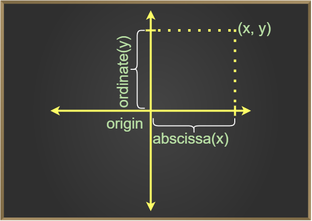
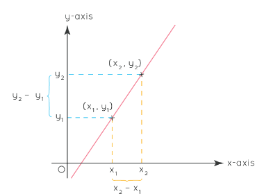
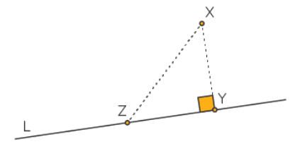
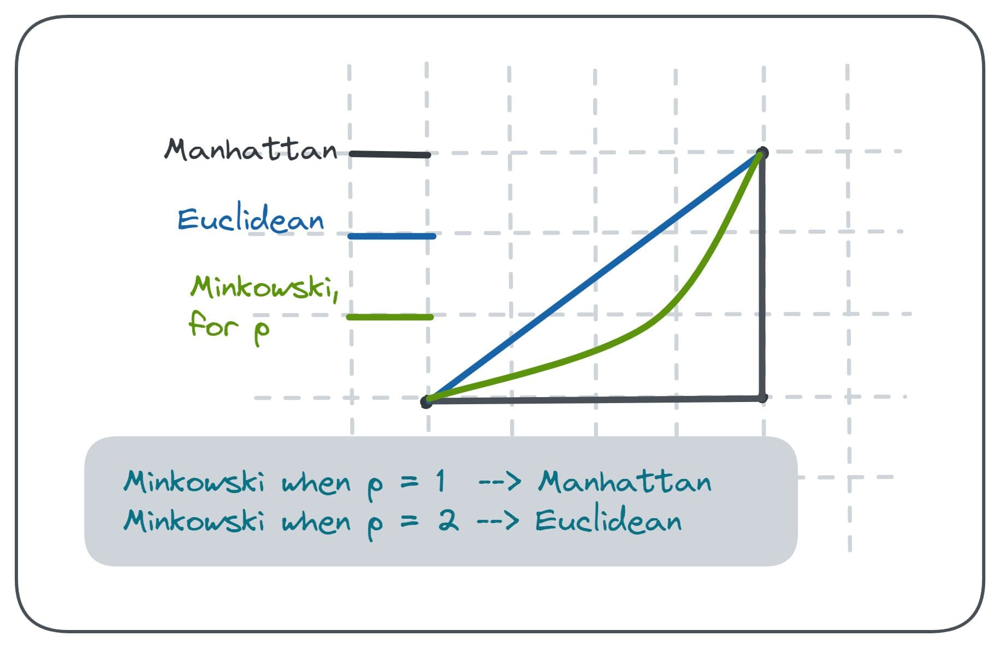
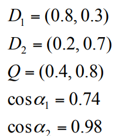

## Introduction

- Coordinate geometry is a branch of mathematics, which is used to represent various geometric figures in a 2-D plane. 
- Coordinate geometry is used to describe various curves such as circles, parabolas, etc.
- Coordinate geometry divides the coordinate plane into four different quadrants, which are the I quadrant, II quadrant, III quadrant, and IV quadrants.

 

- A coordinate is an address, which helps to locate a point in space. 
- For a two-dimensional space, the coordinates of a point are (x, y) = (Abscissa, Ordinate)

 

- Origin: The point (0, 0)
- Examples for plotting some points.
- Distance: AB = $\sqrt((x_2 – x_1)^2 + (y_2 – y_1)^2)$
	- Distance from Origin
	- Examples
		- (x1 = -4, y1 = 7) and (x2 = 2, y2 = -5) => 6$\sqrt(5)$
		
- midpoint (x,y) = ${\frac{(x_1+x_2)} {2} , \frac{(y_1+y_2)}{2}}$
- Slope: The slope of a line is the inclination of the line.

- m = tan($\theta$) = $\frac{(y_2 - y_1)} {(x_2 - x_1)}$
- (x1, y1) = (5, 1) , (x2, y2) = (7, 8) => 7/2
- Line
	- $Y = m*x + c$
	- $(y  –  y_1) = m * (x  –  x_1)$
	- $(y – y_1) = \frac{(y_2 – y_1)(x_2 – x_1)} {(x – x_1)}$
	- $\frac{x}{a} + \frac{y}{b} = 1$
	
- Distance to a point from line

-  The distance of a point X from a line L is the length of the perpendicular dropped from X onto L.
-  The distance from a point (x1,y1) to the line Ax + By + C = 0 is given by $d = \frac{|A*x_1 + B*y_1 + C|} {√(A^2 + B^2)}$
	- P (5, 6) and -2x + 3y + 4 = 0 => d = 3.328
	- K(−3,7) and  y=(6/5)​ x + 2 => 5.5
	- P(2,-3) and  _x_ + 3y - 1 = 0 => 

## Distance Metrics

- A distance measure is an objective score that summarizes the relative difference between two objects in a problem domain.
- That means if the distance among two data points is **small** then there is a **high** degree of similarity among the objects and vice versa.
- For example, similarity among vegetables can be determined from their taste, size, colour etc.

- The Manhattan distance between the points **x** and **y** is given by- $d(x,y) = \sum |x_i - y_i|$
- The Minkowski distance is defined as pth root of the sum of absolute distances raised to the power of p.
	- $d(x,y) = (\sum |x_i - y_i|^p)^\frac{1}{p}$, where p >=1 
	- p = 1 => Manhattan
	- p = 2 => Euclidean
- Given P1: (10, 2, 4, -1, 0, 9, 1)   and P2: (14, 7, 11, 5, 2, 2, 18)
	- 
- Cosine Distance: we measure the degree of angle between two vectors.  This particular metric is used when the magnitude between vectors does not matter but the orientation.
	- $cos \theta = \frac{a.b}{||a|| * ||b||}$

- d1 = 3 2 0 5 0 0 0 2 0 0 and d2 = 1 0 0 0 0 0 0 1 0 2 => 5 / (6.48 * 2.45) => .3150