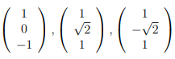
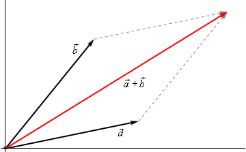
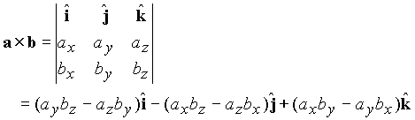

## Vector

- Representation of a Vector and its components.
	- Geometric
	- Algebraic
	
- Length of a Vector - The **magnitude**, or **length**, of the vector $\vec{v}$=⟨a1,a2,a3⟩ is given by,  $∥\vec{v}∥=√a_{1}^2+a_{2}^2+a_{3}^ 2$

### Types of Vectors

- **Row Vector**
- **Column Vector**
- **Zero Vector**
- **Unit Vector** - Any vector with magnitude of 1, _i.e._ ∥$\vec{u}$∥=1, is called a **unit vector**. Given a vector $\vec{w}$, $\vec{u}$= $\frac{\vec{w}} {|| \vec{w}||}$ will be a unit vector that points in the same direction as $\vec{w}$.

- **Position Vector** - The representation of the vector $\vec{v}$=⟨a1,a2,a3⟩ that starts at the point A=(0,0,0) and ends at the point B=(a1,a2,a3) is called the **position vector** of the point (a1,a2,a3).

- **Displacement Vector** -  Generate a vector given the initial and final points of the representation. Given the two points A=(a1,a2,a3) and B=(b1,b2,b3) the vector with the representation $\vec{AB}$ is, $\vec{v}$=⟨b1−a1,b2−a2,b3−a3⟩. Note that we have to be very careful with direction here. The vector above is the vector that starts at A and ends at B. The vector that starts at B and ends at A, _i.e._ with representation $\vec{BA}$ is, $\vec{w}$=⟨a1−b1,a2−b2,a3−b3⟩
- **Normal Vector** - perpendicular to the surface at a given point. 
$$N = \frac{a x b} {\sqrt{|a|^{2}+ |b|^{2}- |a.b|^2}}$$
- **Direction Vector** = [1, slope] from the origin for a given straight line.

- **Eigen Vector**
- **Orthogonal Vector** - We say that 2 vectors are orthogonal if they are perpendicular to each other. i.e. the dot product of the two vectors is zero.

- **Orthonormal Vector** - A set of vectors S is orthonormal if every vector in S has magnitude 1 and the set of vectors are mutually orthogonal.
- **Basis Vector** - 

### Properties of Vectors

- Commutativity of vector addition - $\vec{a} + \vec{b}=⟨a_1+b_1,a_2+b_2,a_3+b_3⟩$

 This is called the **parallelogram law** or **triangle law**.
	
- Associativity of vector addition
- Zero vector addition
- Additive inverse
- Scalar Multiplication of a Vector - changes only the magnitude. $c*\vec{a}=⟨ca_1,ca_2,ca_3⟩$

$$\begin{array}{ll}\vec v + \vec w = \vec w + \vec v \hspace{0.75in} & \vec u + \left( {\vec v + \vec w} \right) = \left( {\vec u + \vec v} \right) + \vec w\\ \vec v + \vec 0 = \vec v \hspace{0.75in} & 1\vec v = \vec v\\ a\left( {\vec v + \vec w} \right) = a\vec v + a\vec w \hspace{0.75in} & \left( {a + b} \right)\vec v = a\vec v + b\vec v\end{array}$$

- Vector Multiplication
	- Dot Product - $a · b = |a| * |b| * cos(θ)$ or $a · b = a_x * b_x + a_y * b_y$ Result is a scalar
	- Cross Product - The cross product is only valid in **R3**, and it gives us a vector orthogonal to any two nonparallel vectors having a magnitude equal the area of the parallelogram generated by the two vectors.

- $\vec a \times \vec b = \vec 0$ = Parallel vectors
- Orthogonality ->  u.v = 0
- Triangle Inequality -> |u + v| $\leq$ |u| + |v|
 

## Matrix

- Square Matrix
- Diagonal Matrix
- Identity Matrix
- Upper Triangle Matrix
- Lower Triangle Matrix
- Symmetric Matrix
- Singular Matrix => determinant is zero

### Operations

- Addition
- Subtraction
- Multiplication
- Transpose
- Determinant
- Inverse

## Linear Equations

- Solving a Linear Equation
	- Graphical
	- Substitution
	- Elimination
	- Matrix