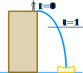

Example- Suppose we know the equation for circumference (2\*pi\*r) and want to find area of the circle.

This is a recurring theme in calculus: **Big things are made from little things.** And sometimes the little things are easier to work with.

- The derivative of a circle _with respect to_ the radius creates rings (which always increase)
- The derivative of a circle _with respect to_ the perimeter creates slices (which are equal-sized)
- The derivative of a circle _with respect to_ the x-axis creates boards (which get larger, peak, and get smaller)

The **integral** is gluing together (Time-Lapsing) a bunch of slices and measuring the final result.
- **Which direction are we gluing the steps together?**
- **When do we start and stop?**
- **How big is each step?**

# What is Calculus?

## Differential vs Integral calculus

And Differential Calculus and Integral Calculus are like **inverses** of each other.
**Differential Calculus** cuts something into small pieces to find how it changes.
**Integral Calculus** joins (integrates) the small pieces together to find how much there is.

A truck travels the 2900 km distance in about 72 hrs. What is its speed? 
- s = d /t => 40.28 km/hr.
- The driver tells his friend that a traffic constable fined him for speeding above 80km/h.
- The driver then mentions that he covered the 260 km. stretch in 4 hrs with 1 hr break for lunch.
- So it is clear that average speed and instantaneous speed are different concepts.

- Similarly, How fast will you be falling at 1 second?
- 
- d = 1/2 \* g * t^2 = 5t^2
- s = d/t
- invent a time **so short it won't matter**. - Δt
- at t = 1 => 5t^2 = 5 × (1)^2 = 5 m
- at t = 1 + delta(t) => 5t^2 = 5 × (1+Δt)^2 m => d= **5 + 10Δt + 5(Δt)^2 m**
- So between **1 second** and **(1+Δt) seconds** we get: Change in d= 5 + 10Δt + 5(Δt)2 − 5 m
- s = 10Δt + 5(Δt)2 / Δt => **10 + 5Δt** m/s
- Set **Δt**  to zero.
- speed at time t = d/dt (distance travelled in Δt)

Task: y = x^2 or x^3.

Rate of change of the function in a given interval is obtained by differentiation at the point or interval.

### Limits

- (x^2 - 1) / (x - 1) at x = 1 
- Plug in values for x closer to 1
- 
- Limit does not exists when left side and right side limits are different.
- floor(x), 1/x, 

Continuity
- |x|, 1 / (x-1)

Derivatives

- $\frac{df}{dx} = \lim_{h->0} \frac{f(x+h) - f(x)} {h}$
- x^2 => 2x
- Applications
	- Finding Rate of Change of a Quantity
	- Finding Maxima and Minima, and Point of Inflection
	- Determining Increasing and Decreasing Functions
- Techniques and common derivatives

|Common Functions|Function|Derivative|
|---|:-:|:-:|
|Constant|c|0|
|Line|x|1|
||ax|a|
|Square|x2|2x|
|Square Root|√x|(½)x-½|
|Exponential|ex|ex|
||ax|ln(a) ax|
|Logarithms|ln(x)|1/x|
||loga(x)|1 / (x ln(a))|
|Trigonometry (x is in [radians](https://www.mathsisfun.com/geometry/radians.html))|sin(x)|cos(x)|
||cos(x)|−sin(x)|
||tan(x)|sec2(x)|
|Inverse Trigonometry|sin-1(x)|1/√(1−x2)|
||cos-1(x)|−1/√(1−x2)|
||tan-1(x)|1/(1+x2)|

|Rules|Function|Derivative|
|---|:-:|:-:|
|Multiplication by constant|cf|cf’|
|[Power Rule](https://www.mathsisfun.com/calculus/power-rule.html)|xn|nxn−1|
|Sum Rule|f + g|f’ + g’|
|Difference Rule|f - g|f’ − g’|
|[Product Rule](https://www.mathsisfun.com/calculus/product-rule.html)|fg|f g’ + f’ g|
|Quotient Rule|f/g|_f’ g − g’ f_**g2**|
|Reciprocal Rule|1/f|−f’/f2|
||||
|Chain Rule   (as ["Composition of Functions")](https://www.mathsisfun.com/sets/functions-composition.html)|f º g|(f’ º g) × g’|
|Chain Rule (using ’ )|f(g(x))|f’(g(x))g’(x)|
|Chain Rule (using _d_**dx** )|_dy_**dx** = _dy_**du**_du_**dx**|   |

## Examples

- $x^7$
- $\dfrac{d}{dx} . \dfrac{1}{ \sqrt x} = \dfrac{-1}{2x \sqrt {x}}$
- d/dx = $Cos^2 x$ is = -sin 2x
- 
## Integral Calculus

 =  or  or 

-  =>   i.e. Area of triangle = _1_/ **2**(base)(height) = _1_/**2**(x)(2x) = x^2
- It is the "Constant of Integration". It is there because of **all the functions whose derivative is 2x**
-  
-    

- Example: Tap and Tank
-   =  
- We can integrate that flow (add up all the little bits of water) to give us the **volume of water** in the tank.
- With a flow rate of 1 liter per second, the volume increases by 1 liter every second, so would increase by 10 liters after 10 seconds, 60 liters after 60 seconds, etc.
-  
-  

|Common Functions|Function|Integral|
|---|:-:|:-:|
|Constant|∫a dx|ax + C|
|Variable|∫x dx|x2/2 + C|
|Square|∫x2 dx|x3/3 + C|
|Reciprocal|∫(1/x) dx|ln\|x\| + C|
|Exponential|∫ex dx|ex + C|
||∫ax dx|ax/ln(a) + C|
||∫ln(x) dx|x ln(x) − x + C|
|Trigonometry (x in [radians](https://www.mathsisfun.com/geometry/radians.html))|∫cos(x) dx|sin(x) + C|
||∫sin(x) dx|-cos(x) + C|
||∫sec2(x) dx|tan(x) + C|
||||
|Rules|Function|Integral|
|Multiplication by constant|∫cf(x) dx|c∫f(x) dx|
|Power Rule (n≠−1)|∫xn dx|_xn+1_**n+1** + C|
|Sum Rule|∫(f + g) dx|∫f dx + ∫g dx|
|Difference Rule|∫(f - g) dx|∫f dx - ∫g dx|
|Integration by Parts|See [Integration by Parts](https://www.mathsisfun.com/calculus/integration-by-parts.html)|  ∫u v dx = u∫v dx −∫u' (∫v dx) dx  | Use  I LATE to choose 'u'
|Substitution Rule|See [Integration by Substitution](https://www.mathsisfun.com/calculus/integration-by-substitution.html)|   |

- Applications
	- 