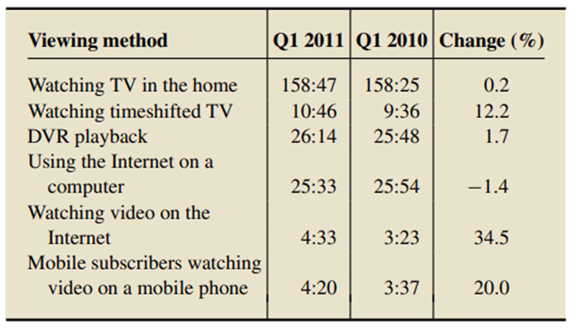
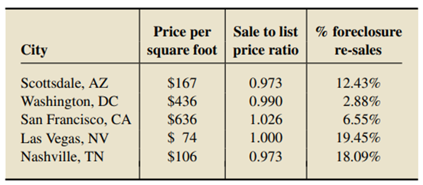

# What is data?

- What does data mean?
- Is data storage important?
- Data plays a key role in business
- Data Collections, Maintenance and usage
  - Population, birth, deaths, marriages
- What is statistics?
- Examples
  - consumer preference of brand
  - crop production
  - doctor consultation time/ waiting time

# Why Statistics?

- Analyse and utilize data
- Benefits
  - comparison - compare the marketing campaigns
  - forecasting - death rates, sales
  - generalization - bank feedback cannot be from all customers
  - efficiency
  - decision making
  - presentation

## Types of Statistics

- Descriptive - collection, presentation, characterization
- Inferential - estimate the characteristics of population, test hypothesis.
- Predictive - trend, relationship, behavioral pattern

## Statistics with Data Science

- Communication - Retrieval - Analysis
- What is data science? and its use.
- Data generation in business - IoT, cheap storage,
- Example - ICU management
- Statistics for business success
- use of statistics with big data

## Case Studies

- Global Retail Chain - products purchased, rearranging the products in store
- Healthcare
- Machine Learning - fraud, face, self driving cars, patient identification
- Computer vision
- Industrial production
- Energy usage
- Infrastructure building
- Finance
- Decision Making and planning

# Q&A

"In a national poll taken on August 7–11, 2013, by Gallup, Inc., 1039 adults who were employed full or part time were asked the following question: “If you won 10 million dollars in the lottery, would you continue to work, or would you stop working?” Sixty-eight percent of the respondents said that they would continue to work".

a. Is this study descriptive or inferential? Explain your answer.   
**Descriptive**

b. The title of the article discussing the survey was “In U.S., Most Would StillWork Even if TheyWon Millions.” Is the statement in quotes here descriptive or inferential? Explain your answer.   
**Inferential**

---

1.  A sample of British backpackers tourists visiting South Africa were interviewed. ThImagese information obtained from the sample was used to construct the following table for the age distribution of all British backpackers. Classify this study as descriptive or inferential, and explain your answer.

| Age (yr) | Percentage |
| -------- | ---------- |
| Less than 21 | 9 |
| 21–25 | 46 |
| 26–30 | 27 |
| 31–35 | 10 |
| 36–40 | 4 |
| Over 40 | 4 |

**Inferential**

---

1.  The document _“American Attitudes about Genocide”_ provided highlights of a nationwide poll with 1000 participants. The survey, conducted by Penn Schoen Berland between June 30 and July 10, 2012, revealed that _“66% of respondents believe that genocide is preventable."_  
    a. Is the statement in quotes an inferential or a descriptive statement? Explain your answer.   
    **Descriptive**

```
b. Based on the same information, what if the statement had been “66% of Americans believe that genocide is preventable”? \
**Inferential**
```

---

1.  Data from a sample of Americans yielded the following estimates of average TV viewing time per month for all Americans 2 years old and older. The times are in hours and minutes.



**Inferential**

---

1.  Zillow.com is an online database that provides real estate information for U.S. homes that are for rent or sale. It also presents statistics on recently sold homes. The following table gives various information on all homes sold in several different cities across the United States for the month of September 2012.




**Descriptive**
