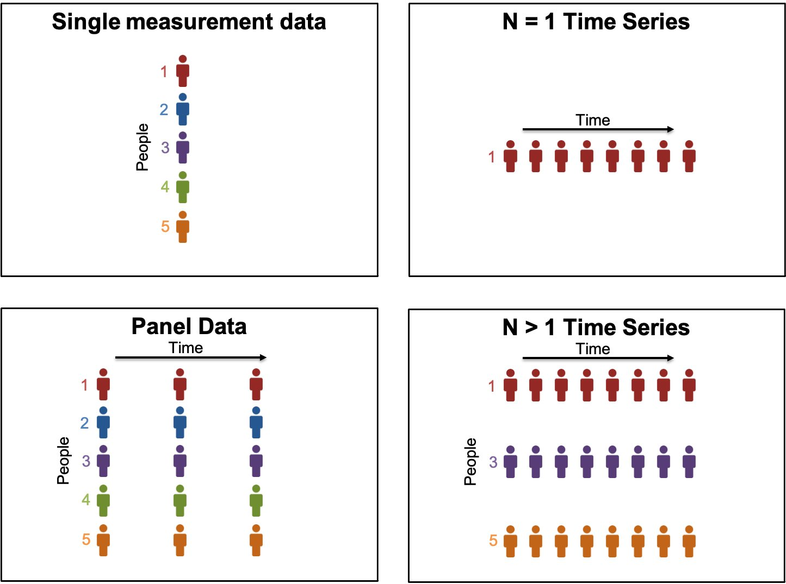
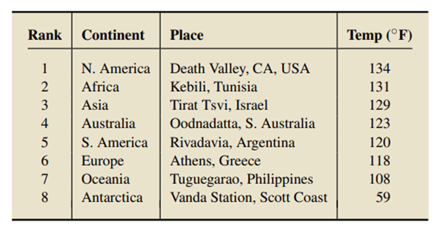
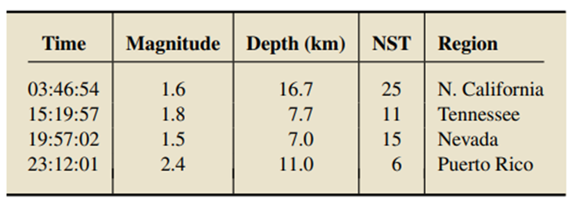

## Data Vs Dataset

Elements
Observations

## Categories of Data

- Qualitative and Quantitative

## Types of Data Collection

- **Raw and Processed data**
- Examples - Tabular data, Image processing such as cropping, resizing, 

Transaction ID | Date       | Product    | Quantity | Unit Price
-------------- | ---------- | ---------- | -------- | -----------
1              | 2023-01-01 | Widget A   | 10       | $20.00
2              | 2023-01-01 | Widget B   | 5        | $15.00
3              | 2023-01-02 | Widget A   | 8        | $20.00
4              | 2023-01-02 | Widget C   | 3        | $25.00
5              | 2023-01-03 | Widget B   | 12       | $15.00

---

Date       | Total Sales | Average Quantity | Average Unit Price
---------- | ----------- | ----------------- | -------------------
2023-01-01 | $350.00     | 7.5               | $17.50
2023-01-02 | $295.00     | 5.5               | $22.50
2023-01-03 | $180.00     | 12                | $15.00

---

Survey ID | Customer ID | Age | Gender | Rating | Feedback
----------|-------------|-----|--------|--------|------------------------
1         | 101         | 30  | Female | 4      | Great experience!
2         | 102         | 45  | Male   | 3      | Good, but could improve.
3         | 103         | 28  | Male   | 5      | Excellent service.
4         | 104         | 35  | Female | 2      | Dissatisfied with wait times.
5         | 105         | 40  | Female | 4      | Happy with the variety of options.

				Average Rating: 3.6

				Gender Breakdown:
				- Male:   Average Rating - 3.3
				- Female: Average Rating - 3.75

				Age Group Breakdown:
				- 18-30:  Average Rating - 4.33
				- 31-40:  Average Rating - 3.0
				- 41-50:  Average Rating - 3.5

---

- **Primary data and Secondary data**
	- PD = data originated for the first time, SD = already existing data.
	- PD = present, SD = past
	- PD = raw format, SD = processed format
	- PD = address the problem in hand, SD = may not
	- PD = time consuming, SD = fast and easy
	
	- Examples - PD = surveys, observations, experiments, questionnaire, personal interview.
	- Examples - SD = government publications, websites, books, journal articles, internal records

	- Develop a comprehensive understanding of the relationship between social media usage and the mental health of teenagers.
	- Understanding of the market landscape, by using the consumer preferences as PD and industry trends as secondary data.

## Types of data

- Cross-sectional - Individuals
	- Health Survey Income and Employment Study Political Opinion Poll Housing Market Analysis,  Environmental Pollution Assessment, 
- Panel or longitudinal - time + cross-sectional => 
	- Employee Performance, Educational Achievement, Household Income and Expenditure, 
- Time Series - 
	- sales, stocks, Exchange Rates, website traffic, population growth, energy consumption, health metrics, climate data.

## Structured and Unstructured data

- Tabular data
- Web logs, multimedia, raw text files,

## Key sources of data

- Data collected and published - Healthcare
- Conducting experiments - agriculture
- Conducting surveys - educational reform
- Observational studies - animal behavior

**Factors for selecting the sources of data**
- Type of study
- Availability of data
- Time frame

## Data Quality

- Timeliness - up to date and relevant data
- Accuracy - free from errors, precision, correctness/validity
- Completeness - no missing data, 
- Reliability - repeatable responses, 
- Consistency - format of data, uniform representation

**Factors affecting the data quality**

- approach for data collection
- communication
- elimination of outlies
- appropriate formats
- expertise of individuals
- willingness to provide data

## Q&A

- 
-      
	- a. Quantitative, continuous; time at which an earthquake occurred
	- b. Quantitative, continuous; magnitude of an earthquake on the Richter scale
	- c. Quantitative, continuous; depth, in kilometers, at which an earthquake occurred
	- d. Quantitative, discrete; number of stations that reported the activity on an earthquake.
	- e. Qualitative; region where an earthquake occurred"						

- Which of the following is ordinal data. 
	- a. Height 
	- b. Weight 
	- c. Age
	- d. Sex
	- e. Number of siblings  
	- f. Religion 
	- g. Place of birth  
	- h. High school class rank						

- A survey by an electric company contains questions on the following:
	1. Age of household head.
	2. Sex of household head.
	3. Number of people in household.
	4. Use of electric heating (yes or no).
	5. Number of large appliances used daily.
	6. Thermostat setting in winter.
	7. Average number of hours heating is on.
	8. Average number of heating days.
	9. Household income.
	10. Average monthly electric bill.
	11. Ranking of this electric company as compared with two previous electricity suppliers.		

		1. quantitative/ratio
		2. qualitative/nominal
		3. quantitative/ratio
		4. qualitative/nominal
		5. quantitative/ratio
		6. quantitative/interval
		7. quantitative/ratio
		8. quantitative/ratio
		9. quantitative/ratio
		10. quantitative/ratio
		11. quantitative/ordinal		

