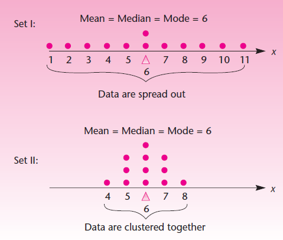
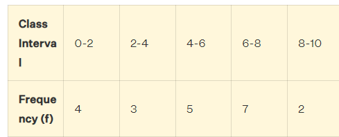
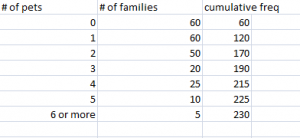

## Central Tendency

- Examples
	- Factory's production
	- Average price of the home
	
- Mean

	- Arithmetic mean vs Geometric mean vs Harmonic mean 
		- AM = sum (all values) / number of values
		- GM = nth root of product of all values
		- HM = n / sum of reciprocals of the values
		- The arithmetic mean is appropriate when all values in the data sample have the same units of measure, e.g. all numbers are heights, or dollars, or miles, etc.
		- The geometric mean does not accept negative or zero values.
		- G-mean is computed as the geometric mean of the sensitivity and specificity metrics.
		- The harmonic mean is the appropriate mean if the data is comprised of rates.
		- A [rate](https://en.wikipedia.org/wiki/Rate_(mathematics)) is the ratio between two quantities with different measures, e.g. speed, acceleration, frequency, etc.

- Median

	- Percentile - divides the data into 2 parts
	- Quartile - divides the data into quarters (4 parts)
	- Deciles - divides the data into tenths
	- Quintiles - divides the data into fifths

- Mode

## Measures of Dispersion

- Need for Dispersion Measure

	

	Set I: 1, 2, 3, 4, 5, 6, 6, 7, 8, 9, 10, 11 
	Set II: 4, 5, 5, 5, 6, 6, 6, 6, 7, 7, 7, 8

#### Types of Dispersion measures

- Range
	- Example - Age
	- wire diameters
- IQR and QR
	- Unusual and  un representative events
	- service delay
- Deviation and Variance
	- Mean deviation
		-  $∑ |xi−μ| \over n$
		-  $∑ f|xi − μ| \over Σf$
		- 302, 140, 352, 563, 455, 215, 213 => 117.14
  - 	   => 2.09
		
	- Standard deviation
	- Variance

- Z-score
	- The z-score of an observation tells us the number of standard deviations that the observation is from the mean.
	- A negative z-score indicates that the observation is below (less than) the mean.
	- Whereas a positive z-score indicates that the observation is above (greater than) the mean.

|   |   |   |   |   |
|---|---|---|---|---|
|Holes at the Augusta National Golf Club|
|HOLE|LENGTH|MEAN|STANDARD DEVIATION|Z-SCORE|
|1|445|413.05556|131.973681|0.242052|
|2|575|413.05556|131.973681|1.227097|
|3|350|413.05556|131.973681|-0.47779|
|4|240|413.05556|131.973681|-1.31129|
|5|455|413.05556|131.973681|0.317824|
|6|180|413.05556|131.973681|-1.76592|
|7|450|413.05556|131.973681|0.279938|
|8|570|413.05556|131.973681|1.18921|
|9|460|413.05556|131.973681|0.355711|
|10|495|413.05556|131.973681|0.620915|
|11|505|413.05556|131.973681|0.696688|
|12|155|413.05556|131.973681|-1.95536|
|13|510|413.05556|131.973681|0.734574|
|14|440|413.05556|131.973681|0.204165|
|15|530|413.05556|131.973681|0.886119|
|16|170|413.05556|131.973681|-1.8417|
|17|440|413.05556|131.973681|0.204165|
|18|465|413.05556|131.973681|0.393597|

---

- Coefficient of Variation
	- The coefficient of variation is a type of measure of dispersion.
	- It is expressed as the ratio of the standard deviation to the mean. ( $σ \over μ$$* 100$ .)
	- It helps to compare two data sets on the basis of the degree of variation.
	- Example
		- Find the population coefficient of variation of the given data set (320, 540, 480, 540, 420, 240)
		- $\mu$ = 423.3, $\sigma$ = 111.6, variation = 26.36%
		- Find the sample coefficient of variance of the given data set (31.9, 42.5, 55.2, 67.8)
		- $\mu$ = 49.35, $\sigma$ = 15.55, variation = 31.5%

- Bowley's coefficient of skewness
	- Bowley Skewness is an absolute measure of skewness. In other words, it’s going to give you a result in the units that your distribution is in.
	- Bowley Skewness = (PQ3 + PQ1 – 2* PQ2) / (PQ3 – PQ1)
	-   Q1 = 57, Q2 = 115, Q3 = 173, PQ1 = 0, PQ2 = 1, PQ3 = 3, Skewness = 0.33

