What is Data Visualization?

## Bar Chart

- Bar Charts are useful for comparing data points in one or more data series.
- For a bar chart, data should be structured with categories along the vertical axis and values along the horizontal axis.

    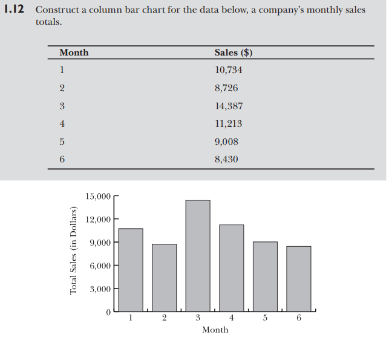

    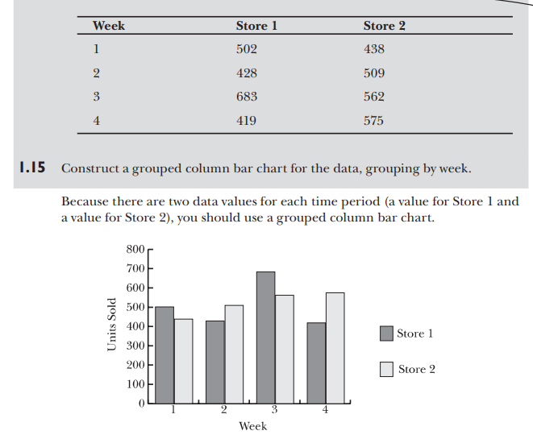

    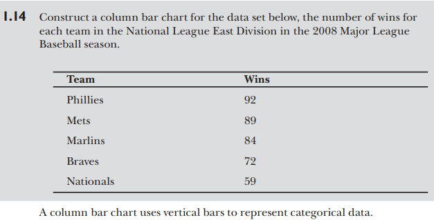

    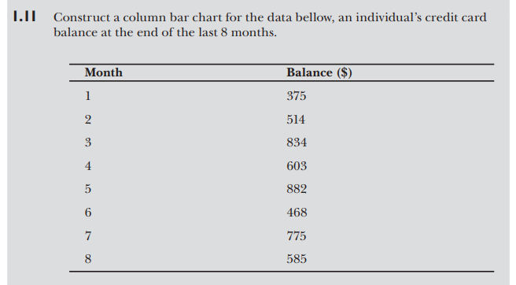

    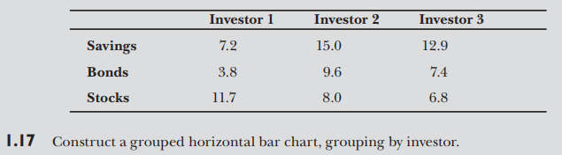

## Line Chart

- Line Charts are used to display trends in relation to a common scale
- In a Line Chart, the horizontal axis displays category data and all value data is displayed evenly along the vertical axis.

    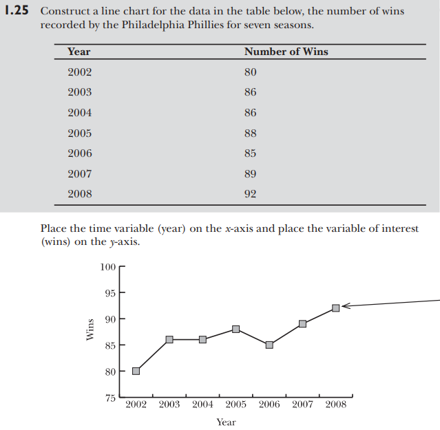

    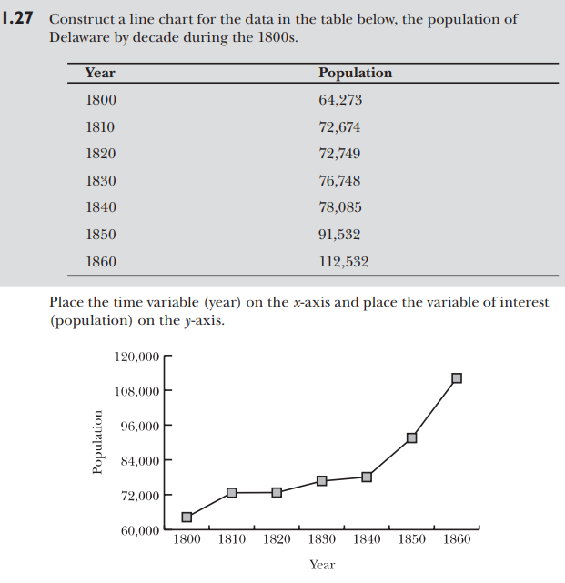

    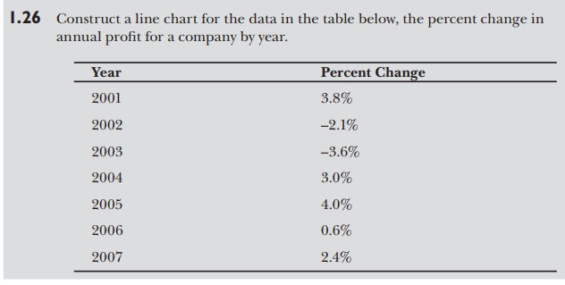

    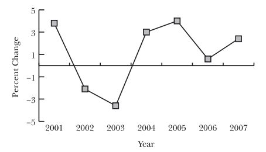

## Pie Chart

- Pie Charts are used to show the contribution of each value (slice) proportionally to the sum of the items, the total (pie).
- If you are plotting only one Data Series.
- If no negative values are in the Data Series.
    

    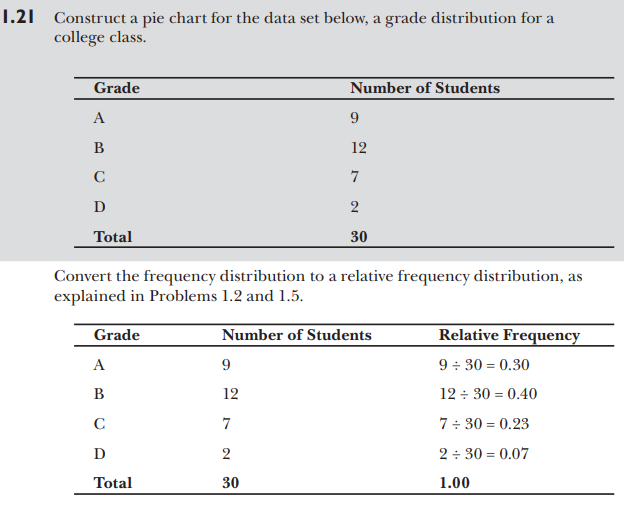

    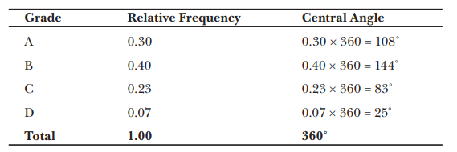

    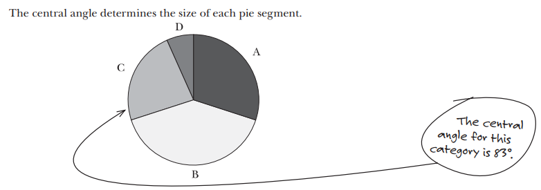

    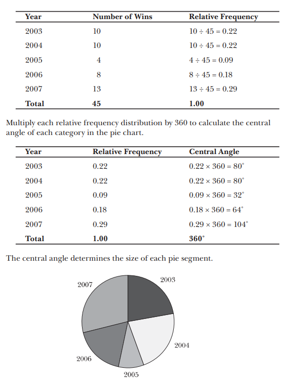

    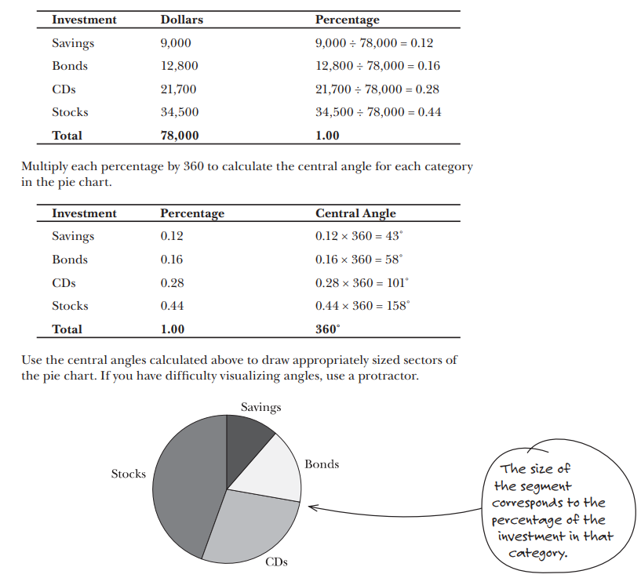

## Histogram

- A histogram is defined as a graphical depiction of the distribution of numerical data.
- A histogram is a column chart that represents the frequency of data in the specified range.
- Used for continuous data
- Histograms are commonly used in statistics for visualizing the shape, center, and spread of a dataset.

    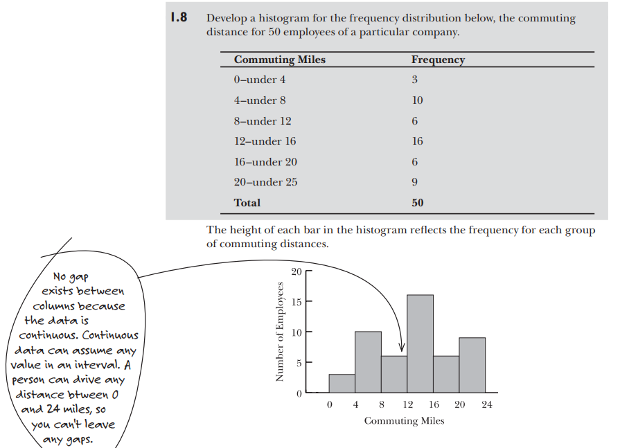

    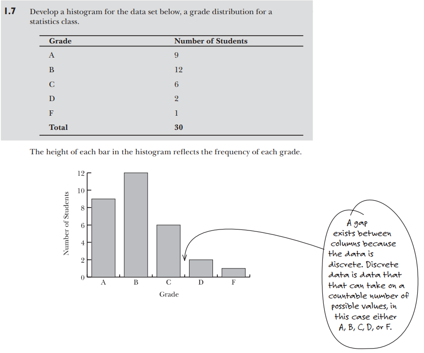

## Box Plot

- The Box and Whisker Chart shows four aspects of the data; high point, low point, a median range, and the mid point.

    - 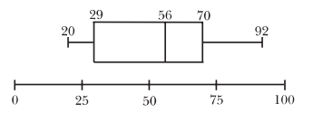
    - 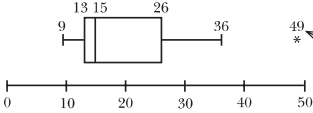
    - 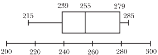 

## Scatter Plot

- Scatter Charts, also referred to as XY charts, are used to find relationships between X and Y variables.
- The data points are generated from the intersection of an x and y numerical values.
- If you want to compare large numbers of data points without regard to time.
- If values for horizontal axis are not evenly spaced.
    images

    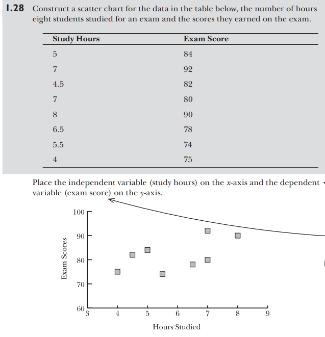

    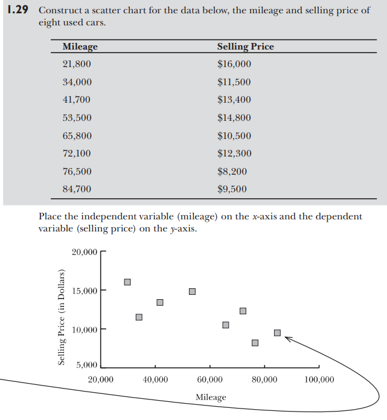

    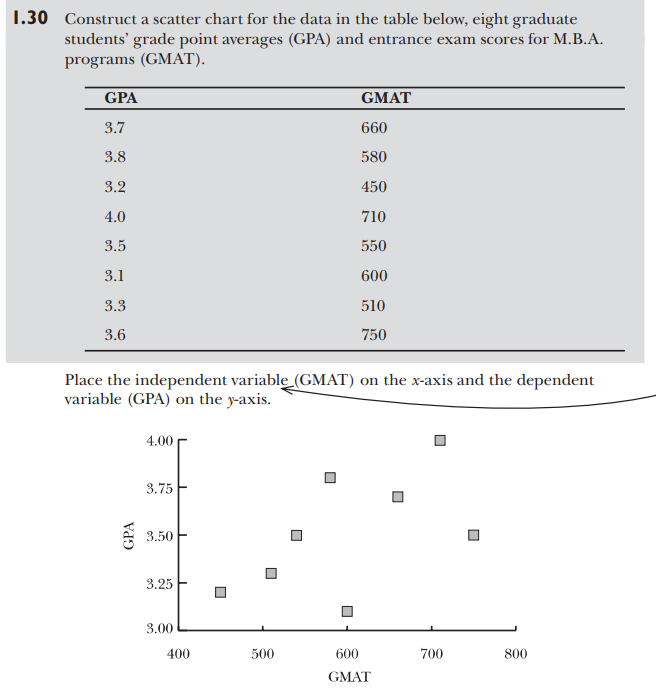

## Bubble Plot

- The Bubble Chart is a variation of a Scatter Chart where data points are replaced with bubbles that visually emphasize specific values. 
- The size of the bubbles adds an additional dimension to the data.
- The Bubble Chart plots X and Y values but adds a Z (size) to the values.

| Car Model      | Fuel Efficiency (MPG) | Horsepower | Price  |
|----------------|-----------------------|------------|---------------------|
| Toyota Camry   |           30          |     203    |         15          |
| Ford Mustang   |           25          |     450    |         80          |
| Honda Civic    |           35          |     158    |         22          |
| Chevrolet Tahoe|           18          |     355    |         50          |
| Tesla Model 3  |           60          |     283    |         65          |

| Company      | Revenue (Millions) | Profit Margin (%) | Market Capitalization (Billions) |
|--------------|--------------------|-------------------|-----------------------------------|
| Apple        |        260         |        21         |               230               |
| Google       |        150         |        18         |               1,200             |
| Microsoft    |        120         |        15         |               2,000             |
| Amazon       |        300         |        8          |               1,700             |
| Tesla        |        40          |        4          |               800               |

## Surface Plot

- Surface Charts are used to show how a set of data points are connected in a three-dimensional surface.
- The X (horizontal) axis uses letters or numbers as does the Y (vertical) axis. Where they intersect is the data point to be plotted on the Z (height) axis.
- The data has to be uniformly spread. Like rows, columns, and cells.

## Q&A

- **Bar chart**

|   |   |
|---|---| 
|Printer Problems|Down Time in Minutes|
|Jams|25|
|Misfeeds|14|
|Out of Ink|19|
|Out of Paper|5|
|Power Surges|8|
|Connection Problems|45|

|   |   |   |   |   |
|---|---|---|---|---|
||QTR 1|QTR 2|QTR 3|QTR 4|
|2010|100030|98050|103000|116200|

|   |   |   |   |   |
|---|---|---|---|---|
|Table: Favorite Type of Movie|
|Comedy|Action|Romance|Drama|SciFi|
|4|5|6|1|4|

- **Bar chart multiple series**

|   |   |   |   |   |
|---|---|---|---|---|
|January|   |   |   |   |
||Sales|Cost|Expenses|Income|
|Week 1|$ 6,458.00|$ 3,551.90|$    968.70|$ 1,937.40|
|Week 2|$ 3,259.00|$ 1,792.45|$    488.85|$    977.70|
|Week 3|$ 8,488.00|$ 4,668.40|$ 1,273.20|$ 2,546.40|
|Week 4|$ 7,259.00|$ 3,992.45|$ 1,088.85|$ 2,177.70|

- **Line and Scatter Chart**

|   |   |   |
|---|---|---|
|Date|Daily Rainfall|Particulate|
|01-01-2007|4.1|122|
|02-01-2007|4.3|117|
|03-01-2007|5.7|112|
|04-01-2007|5.4|114|
|05-01-2007|5.9|110|
|06-01-2007|5|114|
|07-01-2007|3.6|128|
|08-01-2007|1.9|137|
|09-01-2007|7.3|104|

|   |   |   |   |   |
|---|---|---|---|---|
|Month|Rain fall|Air Temp|Water level|Water Temp|
|Jan-06|2.0|28°|3.0|30°|
|Feb-06|1.0|38°|1.5|35°|
|Mar-06|2.0|55°|1.0|36°|
|Apr-06|2.7|60°|3.0|30°|
|May-06|3.0|65°|3.3|37°|
|Jun-06|2.8|75°|1.0|38°|
|Jul-06|2.8|80°|0.5|30°|
|Aug-06|1.0|90°|0.5|39°|
|Sep-06|2.4|70°|1.4|30°|
|Oct-06|3.3|50°|3.0|35°|
|Nov-06|1.0|42°|2.0|36°|
|Dec-06|2.8|45°|3.0|30°|
|Jan-07|2.0|25°|5.0|37°|
|Feb-07|6.0|32°|3.0|43°|
|Mar-07|3.0|45°|2.0|44°|
|Apr-07|4.0|50°|3.0|30°|
|May-07|5.0|55°|4.0|45°|

|   |   |
|---|---|
|Water Depth|Water Temp|
|10.0|30°|
|9.5|35°|
|9.0|36°|
|8.5|30°|
|8.0|37°|
|7.5|38°|
|7.0|30°|
|6.5|39°|
|6.0|30°|
|5.5|35°|
|5.0|36°|
|4.5|30°|
|4.0|37°|
|3.5|43°|
|3.0|44°|
|2.5|30°|
|2.0|45°|
|1.5|47°|
|1.0|52°|
|0.5|64°|

- **Histogram**  

|   |
|---|
|1977 Beak Depth (mm)|
|8.3|
|7.5|
|8|
|10.6|
|11.2|
|9.1|
|9.5|
|10.5|
|8.4|
|8.6|
|9.2|
|8.8|
|8.5|
|8|
|9.7|
|8.4|
|7.9|
|9.3|
|7.7|
|8.5|
|8.2|
|9.7|
|10.3|
|10.2|
|8.9|

|   |
|---|
|Bin|
|7|
|7.5|
|8|
|8.5|
|9|
|9.5|
|10|
|10.5|
|11|
|11.5|
|12|

|   |
|---|
|1978 Beak Depth (mm)|
|9.8|
|8.5|
|10.3|
|9.9|
|8.8|
|10.1|
|8.2|
|8|
|8.9|
|9.1|
|9.8|
|10.1|
|8.55|
|9.3|
|10|
|10.7|
|9.1|
|8.8|
|10.4|
|10.7|
|9.15|
|11.2|
|10.5|
|9.7|
|8.9|
|10.1|
|8.9|
|9.6|
|8.5|
|10.08|
|9.45|
|8.31|
|9.8|
|9.7|
|10.38|
|10.61|
|8.38|
|10.78|
|11.01|
|10.68|
|8.78|
|10.28|
|10.86|
|11.21|
|9.48|
|9.31|
|9.86|
|9.28|
|9.85|
|10|
