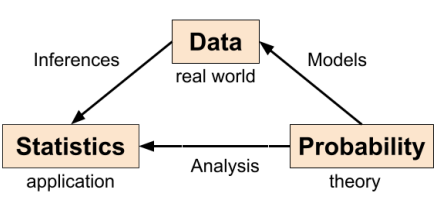
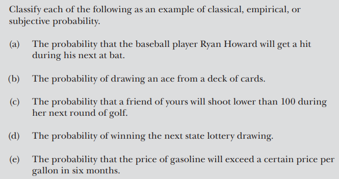
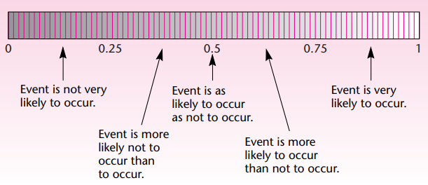
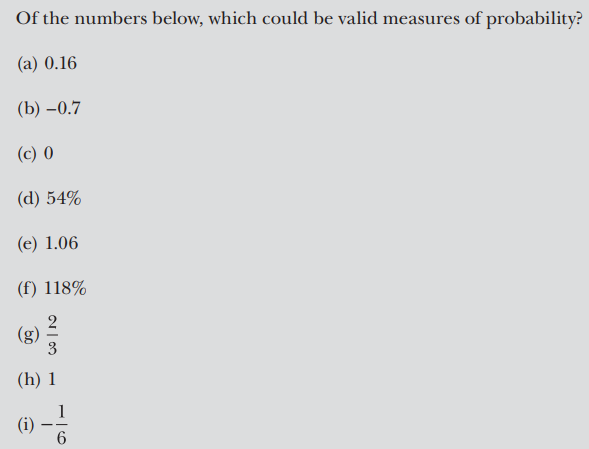
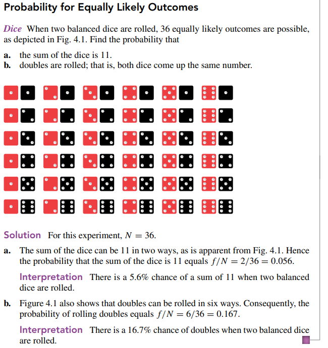
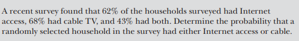
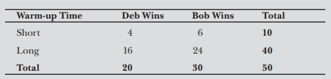

## $\color{cyan}Introduction$

It is used to address uncertainty in planning and decision making.
It forms the basis for inferential statistics.

**Deterministic** - For an object moving with a constant velocity we can determine the current position of the object using the formula, $cp = initial + velocity * time$

$\color{yellow}Examples\ of\ Random\ Events$

- Stock in Inventory
- Pricing Insurance policy
- Weather Forecasting
- Elections
- Time taken to travel
- Performance of a team
- Availability of items
- Tossing a coin
- Rolling a die
- Stocks value
- Rainfall quantity

-  

## $\color{cyan}Basic Definitions and Terminologies$

- A **$\color{yellow}set$** is a collection of elements.
- The **$\color{yellow}empty\ set$** is the set containing no elements '$\phi$'. 
- The **$\color{yellow}universal\ set$** is the set containing everything in a given context. We denote the universal set by '**S**'.
- The **$\color{yellow}complement$** of set 'A' is the set containing all the elements in the universal set S that are not members of set 'A'.
- A **$\color{yellow}Venn\ diagram$** is a schematic drawing of sets that demonstrates the relationships between different sets.
- In statistics, any process or phenomenon that we wish to study statistically is called an $\color{yellow}experiment$.
- An experiment is a process that leads to one of several possible outcomes i.e., result. 
- An **$\color{yellow}outcome$** of an experiment is some observation or measurement.
- The $\color{yellow}sample\ space$ is a set that contains all outcomes of an experiment. It is typically denoted by ‘S’.
- **$\color{magenta}Examples$**
	- In an urn of marbles, there are two red coloured marbles, and each one of blue and white colour. If the experiment is drawing two marbles from the urn with replacement, then write down its sample space. => S = {RR, RB, RW, BR, BW, BB, WR, WB, WW}
	- If the experiment is to draw a card from a well shuffled pack of 52 cards, then write down its sample space. => S = {Hearts, Diamonds, Clubs, Spades}×{2, 3, 4, 5, 6, 7, 8, 9, 10, J, K, Q, A}

- An $\color{yellow}event$ is a subset of a sample space. It is a set of basic outcomes.
- If there are N elements in the sample space, then there can be a maximum of $2^N$ events.
- We say that the event occurs if the experiment gives rise to a basic outcome belonging to the event.
- $\color{magenta}Examples$
	- The event that the card selected is the king of hearts.
	- The event that the card selected is a king.
	- The event that the card selected is a heart.
	- The event that the card selected is a face card.

- $\color{lime}Combining Events$
	- $\color{yellow}Union\ (OR)$ - The union of two or more than two events is the collection of all the outcomes that belong to either of the events. It is denoted by ‘∪’. 
	- Rolling a die: S = {1, 2, 3, 4, 5, 6}. A = {even number} = {2, 4, 6} and B = {multiple of 3} = {3, 6}

	- $\color{yellow}Intersection\ (AND)$ - The intersection of two or more than two events is the collection of all the outcomes that are common to all the events. It is denoted by ‘∩’.
	- Rolling a die: S = {1, 2, 3, 4, 5, 6}. A = {even number} = {2, 4, 6} and B = {multiple of 3} = {3, 6} Implies that, A ∩ B = {even number and multiple of 3} = {6}

	- $\color{magenta}Example$ - For an experiment of rolling a die, let us define the events as follows: A = {even number} and B = {prime number} (i) Find A ∪ B. (ii) Find A ∩ B.
		Solution: A = {even number} = {2, 4, 6} B = {prime number} = {2, 3, 5} (i) A ∪ B = {either an even number or a prime number} = {2, 3, 4, 5, 6} (ii) A ∩ B = {even number and prime number} = {2}

	- $\color{yellow}Disjoint Events$ - Two or more than two events are said to be disjoint events if they have an empty intersection. (i.e., Mutually Exclusive Events - cannot occur simultaneously)
		- Playing Cards For the experiment of randomly selecting one card from a deck of 52, let C = event the card selected is a heart, D = event the card selected is a face card, E = event the card elected is an ace, F = event the card selected is an 8, and G = event the card selected is a 10 or a jack. Which of the following collections of events are mutually exclusive? 
		- a. C and D b. C and E c. D and E d. D, E, and F e. D, E, F, and G
		- c = yes, d= yes, others = no
	
	- We are interested in whether the event will occur or not. If yes, then what are the chances of it occurring?
		- Tossing a coin: What are the chances of getting a head?

- $\color{magenta}Q\&A$
	- Let V = {d}, W = {c, d}, X = {a,b, c}, Y = {a,b} and Z = {a,b,d}. Determine whether each statement is true or false: (i)Y $\subset$ X, (ii) W$\ne$Z, (iii) Z $\supset$ V, (iv) V $\subset$ X, (v) X = W, (vi) W $\subset$ Y.
	- Let U = {1,2, . . .,8,9}, A = {1,2,3,4}, B = {2,4,6,8} and C = {3,4,5,6}. Find: (i) $A^c$, (ii) A$\cap$C, (iii) $(A \cap C)^c$,(iv) A$\cup$B, (v) B - C.
	
## $\color{cyan}Approach\ to\ Probability$

**$\color{yellow}Classic$** 
- We will know the 'S'
- Equally likely events
- Probability is know a priori
- Suppose an event E can occur in s ways out of a total of n equally likely possible ways. Then p = s/n.
- No experiment
- Example - Coin toss and die roll
- P(A) = n(A) / n(S)

**$\color{yellow}Relative$**
- We conduct the experiment and determine the prob
- Compute the relative frequency with 'n' being sufficiently large
- Practically not feasible sometimes
- Example - Coin toss experiment, 
- P(A) = lim n-> inf nA/ nS

**$\color{yellow}Subjective$**
- Based on experience or personal judgement
- Example - Prob of completing the course.

$\color{red}Q\&A$

- 

## $\color{cyan}Basic\ Properties\ of\ Probability$

- A probability is a quantitative measure of uncertainty.
- Probability is a function P that assigns to each event a real number between 0 and 1.
- The probability of an empty set (denoted by $\phi$) equals 0.
- $0 \leq P(A) \leq 1$
- 0 means the event cannot occur, and 1 means it will always occur.
- Higher the output value means higher the chance of occurring of that event. 
-  
- P(S) = 1
- Let (E) be the complement of an event E. Then, P($\overline E$) = 1 − P(E)
- If the event E is a subset of the event F, i.e., E ⊆ F, then P(E) ≤ P(F)
- P(A U B) = P(A) + P(B) - P(A ∩ B)
- Addition Theorem :- If E1, E2, E3, . . . are disjoint events then, P(E1 ∪ E2 ∪ E3 ∪ . . .) = P(E1) + P(E2) + P(E3) + . . .
- Multiplication Theorem :- P(E1 ∩ E2 ∩ E3 ∩ . . .) = P(E1) * P(E2) * P(E3) * . . .
- For mutually exclusive events A and B: P(A ∩ B) = 0 and P(A U B) = P(A) + P(B)

- Mutually Exhaustive Events - if at least one event occur. They account for all possible outcomes.
- Marginal Probability
- Joint Probability

- $\color{magenta}Examples - $
	- Tossing a coin
	- Rolling a die
	- Picking a card
	- Roulette game with 1 to 36 numbers.
	-  
	- Given the probability that a randomly selected student in a class is a female is 56%, determine the probability that the selected student is a male. => 0.44
	- A customer survey asked respondents to indicate their highest level of education. The only three choices in the survey are high school, college, and other. If 31% indicated high school and 49% indicated college, determine the percentage of respondents who chose the “other” category. => 0.20
	-  
	- An experiment has 20 possible outcomes, all equally likely. An event can occur in five ways. The probability that the event occurs is . => 0.25
	- A group of 200 people are asked to write their blood group: 50 have A type, 65 have B type, 70 have O type and 15 have AB type. What is the probability that a person a. has A type? b. has A or AB type? c. does not have O type? => a. 1/4 b. 13/40 c. 13/20
	-  => total = 132418a. 0.178 b. 0.720 c. 0.015 d. 0 e. 1
	-  => 
	-  => 0.62 + 0.68 - 0.43 = 0.87
	-   
		- Determine the probability that a randomly selected car is new. => 0.65
		- Determine the probability that a randomly selected car is a sedan. => 0.55
		- Determine the probability that a randomly selected car is a new sedan. => 0.4
		- Determine the probability that a randomly selected car is either used or an SUV. => 0.35 + 0.45 - 0.2 = 0.6
		

## $\color{cyan}Conditional\ Probability$

- A conditional probability of an event is the probability that the event occurs under the assumption that another event occurs.
- The probability that event B occurs given that event A occurs is called a conditional probability. It is denoted P (B | A), which is read “the probability of B given A.”
- P(B | A) = P(A & B) / P(A) = P(A $\cap$ B) / P(A)
- Example
	- Let F = event a 5 is rolled, and O = event the die comes up odd. Determine the following probabilities: 
		- a. P(F), the probability that a 5 is rolled. 
		- b. P(F | O), the conditional probability that a 5 is rolled, given that the die comes up odd. 
		- c. P (O | (not F) ) , the conditional probability that the die comes up odd, given that a 5 is not rolled.
		- => 1/6, 1/3, 2/5
	- Drawing an ace given that a red card is drawn.
	- Drawing a spade given that the card drawn in black.

Dependent and Independent Events

- Independence of two events A and B: 
	- P(A | B) = P(A) 
	- P(B | A) = P(B) 
	- P(A $\cap$ B) = P(A) * P(B)
- A number appearing odd and a multiple of '2' => Independent
- Drawing a king in a first and a second draw (without replacement) => dependent

- $\color{magenta}Example-$
- Consider again the experiment of randomly selecting one card from a deck of 52 playing cards. Let F = event a face card is selected, K = event a king is selected, and H = event a heart is selected. a. Determine whether event K is independent of event F. b. Determine whether event K is independent of event H.

### $\color{magenta}Examples$

- 
	- a. Determine the probability that the adult selected is divorced, given that the adult selected is a male. 
	- b. Determine the probability that the adult selected is a male, given that the adult selected is divorced.
	- 0.044 / 0.485 = 0.091 and 0.044 / 0.104 = 0.423
- Two manufacturing plants P1 and P2 produce same items. P1 produces 1000 items out of which 100 are defective. P2 produces 2,000 items out of which 150 are defective. A part randomly selected is defective. What is the probability that it is from P1? => 1/30 / 1/12 = 0.4
- 
	- Determine the probability that Deb wins the next match if she only has a short time to warm up. => 0.08 / 0.2 = 0.4
	- Assuming Deb won the last match, determine the likelihood that the warm-up period before the match was short. => 0.4 / 0.08 = 0.2
	- Given that the warm-up time was short, determine the probability that Bob wins the next match. => 0.12 / 0.2 = 0.6
	- Assuming the warm-up time is long, determine the probability that Bob wins the next match. => 0.48 / 0.8 = 0.6
	- Deb claims she has a better chance of winning the match if the warm-up is long. Is there any validity to her claim? 

## $\color{cyan}Bayes\ Theorem$

- The $\color{lime}rule\ of\ total\ probability$
	- 
	- P(B) = P(A1 & B) + P(A2 & B) + P(A3 & B)
	- P(B) = P(A1) · P(B | A1) + P(A2) · P(B | A2) + P(A3) · P(B | A3)
	- Suppose that events A1, A2,..., Ak are mutually exclusive and exhaustive; that is, exactly one of the events must occur. 
	- Then for any event B, P(B) = $\sum$ P(Aj ) · P(B | Aj ).
	- Example
		-   For instance, 17.9% of U.S. residents live in the Northeast, and 14.1% of those who live in the Northeast are seniors.
		- Determine the percentage of U.S. residents that are seniors.
		- P(senior) = $\sum$ P(senior | Region) * P(Region)
		- 0.13

- $\color{lime}Bayes’s\ Rule $
	- Suppose that events A1, A2,..., Ak are mutually exclusive and exhaustive. Then for any event B, $$P(A_i | B) = \frac{P(A_i ) · P(B | A_i )}  {\sum P(A _j ) · P(B | A_ j )}$$where Ai can be any one of events A1, A2,..., Ak.
	- Example-
		- What percentage of seniors are Northeast residents?
		- P(R1 | S) = 0.193
		- According to the Arizona Chapter of the American Lung Association, 7.0% of the population has lung disease. Of those having lung disease, 90.0% are smokers; of those not having lung disease, 25.3% are smokers. Determine the probability that a randomly selected smoker has lung disease.
			- S = event the person selected is a smoker
			- L1 = event the person selected has no lung disease
			- L2 = event the person selected has lung disease
			- 
			- 
			
Example
 - Probability of success of a new product.
